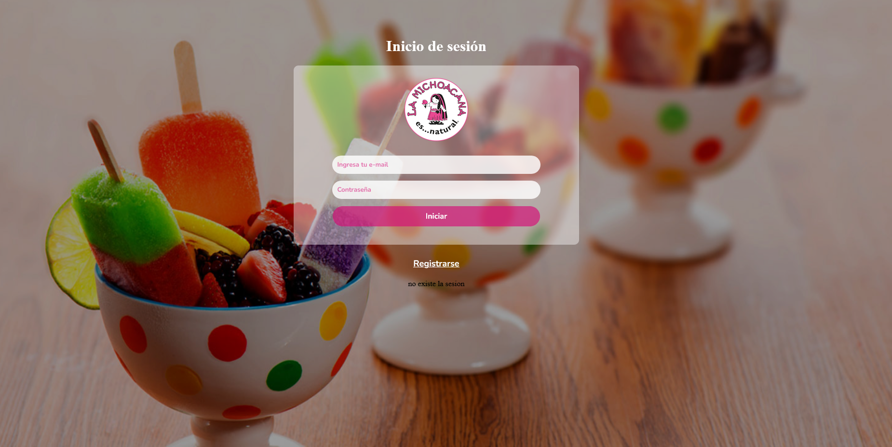
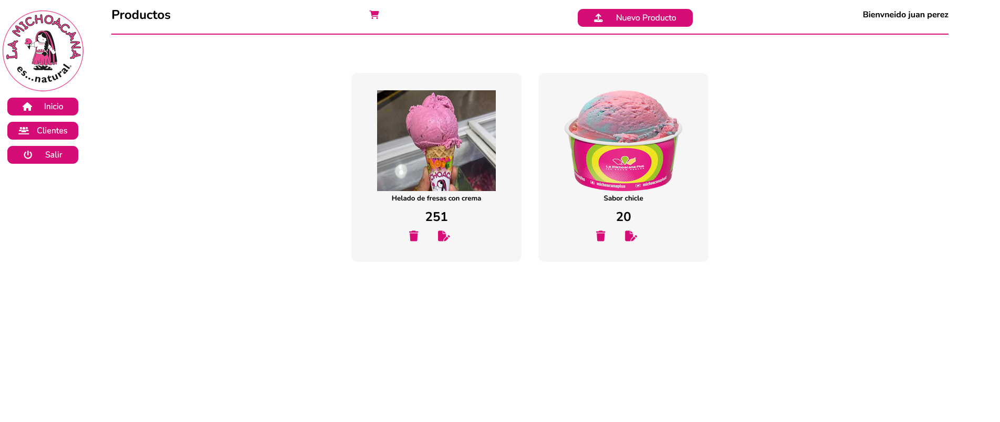
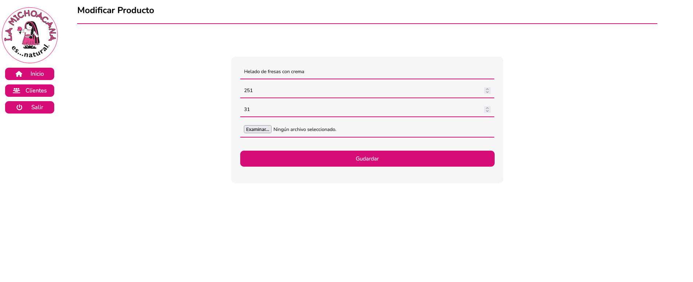
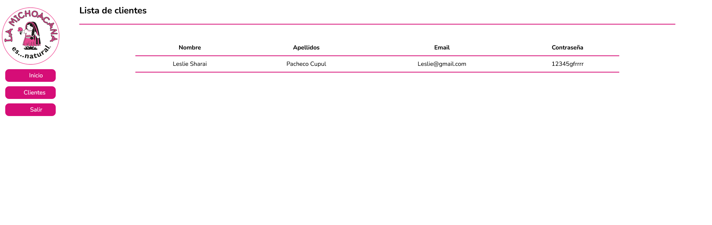
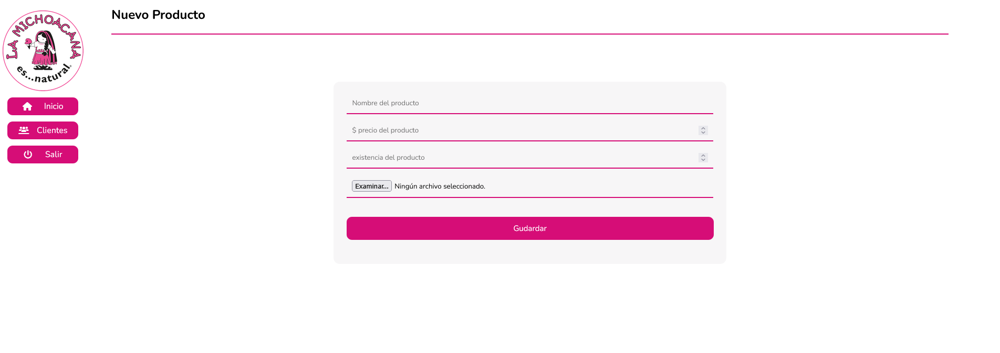
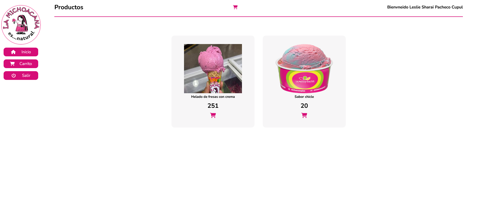
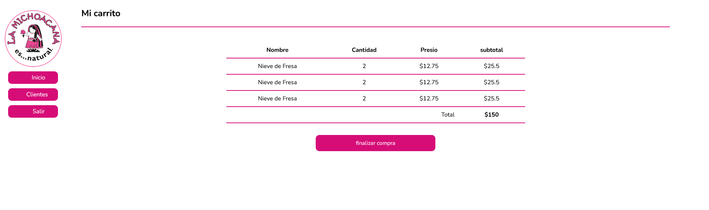

# La michoacana

La aplicación permite el registro, modificación y eliminación de productos, así como el control de inventario y la gestión de ventas en tiempo real. Además, incluye funcionalidades de inicio de sesión para distintos tipos de usuarios, control de accesos.
Se utilizaron tecnologías como 
 
 

aplicando el modelo Vista-Controlador (MVC) y programación orientada a objetos para asegurar una estructura clara y escalable. El sistema fue diseñado con un enfoque en la usabilidad y la eficiencia operativa.

# 📺 Videos con la explicación del proceso de desarrollo

[Configuración de Directorios y Enlaces en PHP](https://youtu.be/haNCMAyFWjQ)

[Conexion a la base de datos PHP MySql Server PDO](https://youtu.be/eX8R5HG8slU)

[Insertar datos PHP MVC](https://youtu.be/ny0Qf73tm-o)

[Visualización de datos PHP MySQL server PDO MVC](https://youtu.be/pIaXw_XPbA8)

[Eliminar registro MySQL server PHP PDO](https://youtu.be/nxc9uVgbzuo)

[Actualizar datos PHP MySQL serve MVC PDO](https://youtu.be/nn8M5gm27Q0)

# Pantallas
## Vista Vendedor

## Vista Cliente

